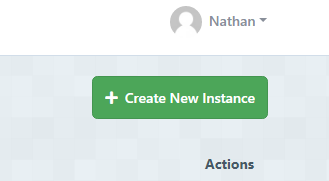
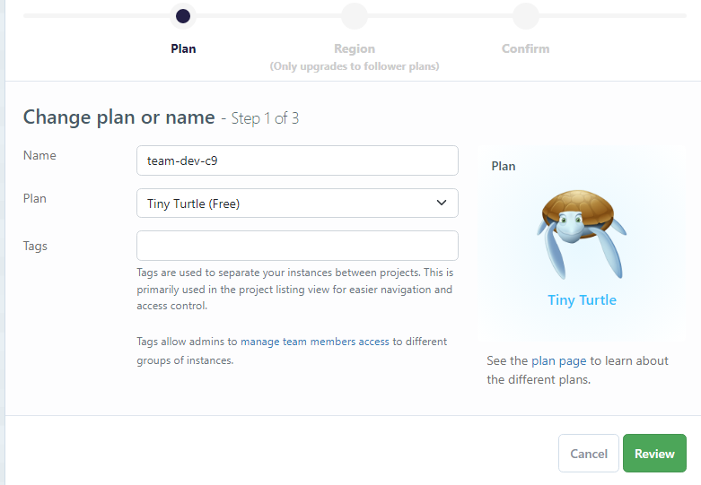
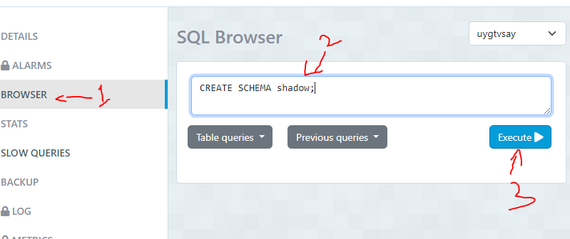

## Creating your databases with ElephantSQL

1. [Sign in to ElephantSQL](https://customer.elephantsql.com/login) using your GitHub account
    - If it asks you to create a team, create one with any name

2. When logged in, click the green *Create New Instance* button in the top right

3. Enter a name for your new database instance and choose the *Tiny Turtle (Free)* plan. 
    - If you are asked to select a region in the next step, select any "Data center" with a region in West Europe (in London or close to London).
    - **This will be your PRIMARY database**

4. In your primary instance:
    - click the *Browser* menu item on the left side of the screen
    - in the SQL Browser text input, enter `CREATE SCHEMA prisma;`
    - click the *Execute* button

5. Repeat step 3 to create a second database, this time give it the same name but add `-shadow` to the end. **This will be your SHADOW database**

6. In your shadow instance:
    - click the *Browser* menu item on the left side of the screen
    - in the SQL Browser text input, enter `CREATE SCHEMA shadow;`
    - click the *Execute* button

